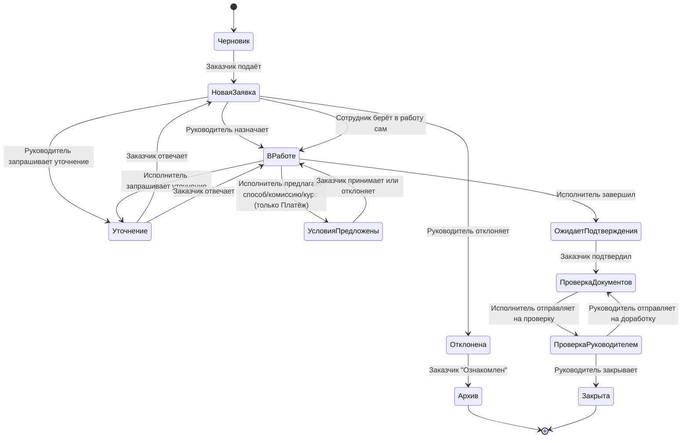

# Жизненный цикл заявки

Сквозной процесс от создания заявки Заказчиком до её закрытия. Каждый этап — отдельная заметка, статусы фиксируются в [[Статусы заявки]], каждое действие — в [[Аудит]].

## Этапы

1. **[[00. Создание заявки|Создание заявки]]** — Заказчик (или, от его имени, Руководитель/Исполнитель отдела — см. [[00. Создание заявки#Создание заявки от имени Заказчика]]) заполняет поля (см. [[01. Поля заявки — Платёж|Поля заявки — Платёж]], [[02. Поля заявки — Закупка|Поля заявки — Закупка]], [[03. Поля заявки — Консультация|Поля заявки — Консультация]]) и подаёт заявку. Статус: Черновик → Новая заявка.
   - Уже на этом шаге Руководитель может запросить уточнение у Заказчика, не назначая исполнителя — см. [[06. Уточнение|Уточнение]] (Новая заявка ⇄ Уточнение).
2. **[[03. Назначение исполнителя|Назначение исполнителя]]** — Руководитель (или [[04. Делегирование полномочий Руководителя|его заместитель]]) назначает Исполнителя, либо отклоняет заявку с указанием причины; либо любой сотрудник отдела берёт заявку в работу сам. Статус: Новая заявка → В работе / Отклонена.
   - При отклонении: Заказчик знакомится с причиной → статус → Архив (терминальный, заявка видна в отчётах и истории).
3. **[[00. Исполнение заявки — обзор|Исполнение заявки]]** — для Платежа сначала [[00a. Согласование условий исполнения (Платёж)|согласование условий]] (способ, комиссия, курс — принятие/отказ Заказчика, цикл В работе ⇄ Условия предложены), затем исполнение по типу: [[01. Исполнение — Платёж через банк|Исполнение — Платёж через банк]], [[02. Исполнение — Платёж через агента|Исполнение — Платёж через агента]], [[03. Исполнение — Закупка|Исполнение — Закупка]] или [[04. Исполнение — Консультация|Исполнение — Консультация]].
   - При необходимости — цикл **[[06. Уточнение|Уточнение]]**: В работе ⇄ Уточнение. Обратных переходов "назад по этапам" сверх циклов Уточнения, Условий и доработки (см. ниже) нет — процесс линейный.
4. **[[07. Подтверждение исполнения Заказчиком|Подтверждение исполнения Заказчиком]]** — неотменяемое действие. Статус: В работе → Ожидает подтверждения Заказчика → Проверка комплектности документов.
5. **[[09. Проверка комплектности и закрытие заявки|Проверка комплектности и закрытие заявки]]** — Исполнитель сверяет обязательные документы по [[Справочник типов документов]] и отправляет на проверку Руководителю; Руководитель закрывает заявку либо отправляет на доработку (цикл Проверка комплектности документов ⇄ На проверке у Руководителя). Статус: → Закрыта.

Для платёжных заявок отдельно фиксируется **[[08. Фактическое исполнение платежа|Фактическое исполнение платежа]]** — реально совершённая операция, как отдельное от заявки понятие.

## Смежные разделы
- [[Роли и права]] / [[Матрица прав]] — кто что может делать на каждом этапе.
- [[Бизнес-правила]] — формальные правила (BR-*), которым подчиняется процесс.
- [[ER модель]] — как это отражено в данных.
