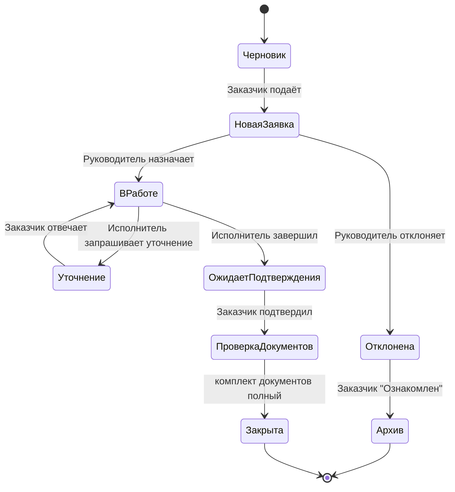

Справочная модель статусов, лежащая в основе [[01. Жизненный цикл заявки|жизненного цикла заявки]].

## Список статусов

| Статус | Описание | Кто переводит | Этап процесса |
|---|---|---|---|
| Черновик | Заказчик заполняет поля, заявка ещё не подана | Заказчик | [[00. Создание заявки|Создание заявки]] |
| Новая заявка | Подана, ожидает решения Руководителя | Заказчик (действие "Подать") | [[00. Создание заявки|Создание заявки]] |
| В работе | Назначен Исполнитель, идёт исполнение | Руководитель / его заместитель | [[03. Назначение исполнителя|Назначение исполнителя]], [[00. Исполнение заявки — обзор|Исполнение заявки — обзор]] |
| Уточнение | Исполнитель ждёт ответ Заказчика | Исполнитель | [[06. Уточнение|Уточнение]] |
| Отклонена | Руководитель отклонил с указанием причины | Руководитель / его заместитель | [[03. Назначение исполнителя|Назначение исполнителя]] |
| Архив | Терминальный статус после отклонения | Заказчик (кнопка "Ознакомлен") | [[03. Назначение исполнителя|Назначение исполнителя]] |
| Ожидает подтверждения Заказчика | Исполнение завершено, ждём подтверждения | Исполнитель | [[07. Подтверждение исполнения Заказчиком|Подтверждение исполнения Заказчиком]] |
| Проверка комплектности документов | Подтверждено Заказчиком, идёт сверка документов | Система / Исполнитель | [[09. Проверка комплектности и закрытие заявки|Проверка комплектности и закрытие заявки]] |
| Закрыта | Терминальный статус, заявка полностью исполнена | Система (автоматически по завершении проверки) | [[09. Проверка комплектности и закрытие заявки|Проверка комплектности и закрытие заявки]] |

## Диаграмма переходов

## Правила
- Обратных переходов "назад по этапам" (кроме цикла [[06. Уточнение|Уточнение ⇄ В работе]]) нет — линейный процесс.
- Переход `Отклонена → Архив` происходит только по явному действию Заказчика (кнопка), не по факту открытия заявки — открытие ненадёжно детектится и не должно быть юридически значимым событием.
- [[07. Подтверждение исполнения Заказчиком|Подтверждение исполнения Заказчиком]] (`Ожидает подтверждения Заказчика → Проверка комплектности документов`) — неотменяемое действие, фиксируется в [[Аудит|аудите]] с указанием пользователя и времени.
- Каждый переход статуса — событие в [[Аудит|журнале аудита]]: кто, когда, из какого статуса в какой, комментарий (если есть).
- Допустимые переходы жёстко определены статусной машиной — нельзя установить статус напрямую, минуя разрешённый переход (см. [[Бизнес-правила|BR-040, BR-041]]).
