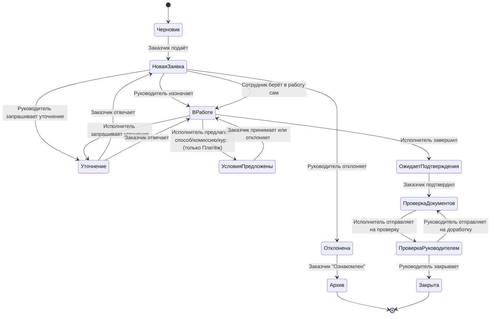

Справочная модель статусов, лежащая в основе [[01. Жизненный цикл заявки|жизненного цикла заявки]].

## Список статусов

| Статус | Описание | Кто переводит | Этап процесса |
|---|---|---|---|
| Черновик | Заказчик заполняет поля, заявка ещё не подана | Заказчик | [[00. Создание заявки|Создание заявки]] |
| Новая заявка | Подана, ожидает решения Руководителя | Заказчик (действие "Подать") | [[00. Создание заявки|Создание заявки]] |
| В работе | Назначен Исполнитель, идёт исполнение | Руководитель / его заместитель / сам Исполнитель | [[03. Назначение исполнителя|Назначение исполнителя]], [[00. Исполнение заявки — обзор|Исполнение заявки — обзор]] |
| Уточнение | Ожидается ответ Заказчика на запрос уточнения (из "Новая заявка" или "В работе") | Исполнитель / Руководитель | [[06. Уточнение|Уточнение]] |
| Условия предложены | Только для Платежа: Исполнитель предложил способ/комиссию/курс, ждём решения Заказчика | Исполнитель | [[00a. Согласование условий исполнения (Платёж)|Согласование условий исполнения (Платёж)]] |
| Отклонена | Руководитель отклонил с указанием причины | Руководитель / его заместитель | [[03. Назначение исполнителя|Назначение исполнителя]] |
| Архив | Терминальный статус после отклонения | Заказчик (кнопка "Ознакомлен") | [[03. Назначение исполнителя|Назначение исполнителя]] |
| Ожидает подтверждения Заказчика | Исполнение завершено, ждём подтверждения | Исполнитель | [[07. Подтверждение исполнения Заказчиком|Подтверждение исполнения Заказчиком]] |
| Проверка комплектности документов | Подтверждено Заказчиком, Исполнитель собирает и проверяет комплект документов | Исполнитель | [[09. Проверка комплектности и закрытие заявки|Проверка комплектности и закрытие заявки]] |
| На проверке у Руководителя | Исполнитель отправил комплект на проверку, ждём решения Руководителя | Руководитель / его заместитель | [[09. Проверка комплектности и закрытие заявки|Проверка комплектности и закрытие заявки]] |
| Закрыта | Терминальный статус, заявка полностью исполнена | Руководитель / его заместитель | [[09. Проверка комплектности и закрытие заявки|Проверка комплектности и закрытие заявки]] |

## Диаграмма переходов

## Правила
- Обратных переходов "назад по этапам" нет, кроме двух побочных циклов: [[06. Уточнение|Уточнение ⇄ Новая заявка / В работе]] и Проверка комплектности документов ⇄ На проверке у Руководителя (доработка, см. [[09. Проверка комплектности и закрытие заявки|Проверка комплектности и закрытие заявки]]).
- Статус "Условия предложены" применяется только к заявкам типа Платёж — см. [[00a. Согласование условий исполнения (Платёж)|Согласование условий исполнения (Платёж)]].
- Переход `Отклонена → Архив` происходит только по явному действию Заказчика (кнопка), не по факту открытия заявки — открытие ненадёжно детектится и не должно быть юридически значимым событием.
- [[07. Подтверждение исполнения Заказчиком|Подтверждение исполнения Заказчиком]] (`Ожидает подтверждения Заказчика → Проверка комплектности документов`) — неотменяемое действие, фиксируется в [[Аудит|аудите]] с указанием пользователя и времени.
- `Проверка комплектности документов → На проверке у Руководителя → Закрыта` — заявку закрывает только Руководитель (или его заместитель); Исполнитель лишь готовит комплект и отправляет на проверку.
- Каждый переход статуса — событие в [[Аудит|журнале аудита]]: кто, когда, из какого статуса в какой, комментарий (если есть).
- Допустимые переходы жёстко определены статусной машиной — нельзя установить статус напрямую, минуя разрешённый переход (см. [[Бизнес-правила|BR-040, BR-041]]).
