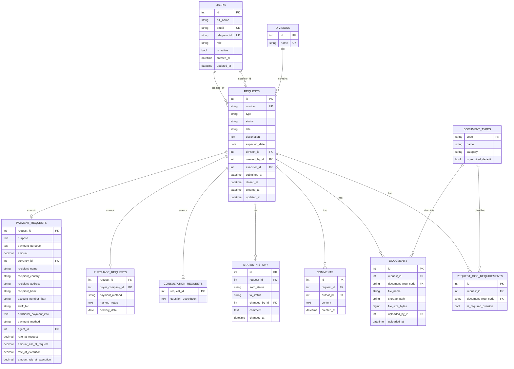
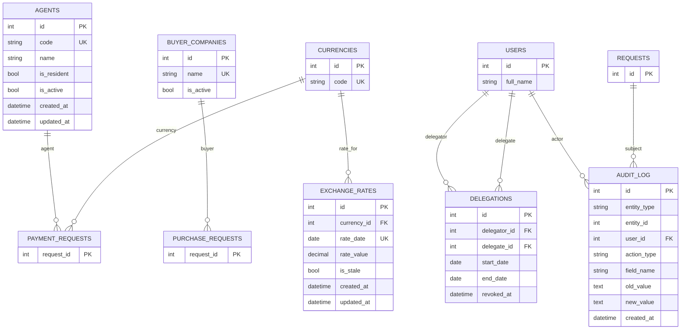

ER-модель для системы трекинга платежей (17 таблиц). Разбита на две части: ядро процесса (заявки) и справочники/аудит. Диаграммы в формате mermaid — Obsidian отрисовывает их нативно (плагин mermaid встроен).

Поля `created_at` / `updated_at` (из `TimestampMixin`) есть у таблиц `REQUESTS`, `USERS`, `AGENTS`, `EXCHANGE_RATES`; на остальных таблицах они отсутствуют — точки во времени фиксируются через специализированные поля (например, `changed_at`, `uploaded_at`).

## Часть 1: ядро процесса

Заявка (`REQUESTS`) — общая таблица с полями, одинаковыми для всех типов заявок (см. [[00. Создание заявки|Создание заявки]]). Три таблицы-расширения (`PAYMENT_REQUESTS`, `PURCHASE_REQUESTS`, `CONSULTATION_REQUESTS`) хранят поля, специфичные под тип заявки (паттерн "таблица на тип" — table-per-type, см. [[Архитектурные решения|ADR-001]]), вместо одной гигантской таблицы с кучей NULL-полей.

Документы и требования к комплекту документов ссылаются на единый справочник [[Справочник типов документов]] — это решает проблему дублирования, которая была в старых заметках по процессам исполнения (см. [[Архитектурные решения|ADR-002]]).

## Часть 2: справочники, курсы валют, делегирование, аудит

## Ключевые решения по модели

- **`REQUESTS.status`** — текущий статус хранится прямо в заявке (для быстрых выборок и фильтров в UI). `STATUS_HISTORY` — отдельный неизменяемый лог переходов, используется для аудита и отчётности по SLA (среднее время обработки, см. [[Отчётность]]). Текущий статус не восстанавливается из истории на каждый запрос — это денормализация ради производительности. Полная модель статусов — [[Статусы заявки]].
- **`REQUEST_DOC_REQUIREMENTS`** — таблица-исключение. По умолчанию обязательность документа берётся из `DOCUMENT_TYPES.is_required_default`, но Руководитель может переопределить перечень обязательных документов для конкретной заявки, не трогая общий справочник (см. [[09. Проверка комплектности и закрытие заявки|Проверка комплектности и закрытие заявки]] и [[Бизнес-правила|BR-052]]).
- **`AUDIT_LOG`** — универсальная таблица (`entity_type` + `entity_id`), а не отдельная таблица под каждый тип события. Проще в поддержке при 50-100 пользователях, чем плодить audit_requests, audit_documents и т.п. Соответствует требованиям из [[Аудит]].
- Один и тот же `USERS.id` встречается и как заказчик, и как исполнитель, и как участник делегирования — роль не жёстко зашита в отдельные таблицы, а определяется полем `role` и тем, в какой роли пользователь упомянут в конкретной заявке (см. [[Роли и права]]).
- `PAYMENT_REQUESTS` хранит `rate_at_request` / `rate_at_execution` — см. edge cases по курсу ЦБ в [[01. Поля заявки — Платёж|Поля заявки — Платёж]] и [[08. Фактическое исполнение платежа|Фактическое исполнение платежа]].

## Реализация
Модель уже реализована как SQLAlchemy 2.0 модели (17 таблиц) и первая Alembic-миграция под стек FastAPI/PostgreSQL — см. `paytracker/README.md` в этой же папке (`06. Данные/paytracker/`). Комментарии в коде моделей ссылаются на конкретные заметки этого vault. Проверено на PostgreSQL 16: `alembic upgrade head` / `alembic downgrade base` / повторный upgrade, сквозная запись/чтение через ORM. Соотносится с [[Архитектурные решения]] и [[Нефункциональные требования]].
